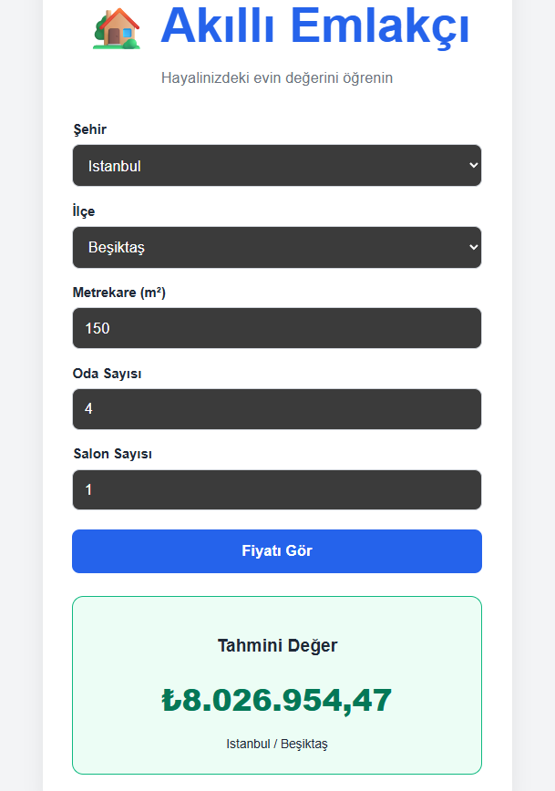

# 🏠 Turkey Real Estate Price Prediction 2025

Bu proje, Türkiye'deki 2025 yılı konut piyasası verilerini kullanarak; Metrekare, Oda Sayısı, İl ve İlçe bilgilerine göre ev fiyatı tahmini yapan uçtan uca bir makine öğrenmesi uygulamasıdır.

## 🚀 Proje Özeti
Kullanıcı dostu bir arayüz üzerinden girilen ev özelliklerini alan sistem, arka planda çalışan eğitilmiş Random Forest modeli ile gerçeğe en yakın fiyat tahminini sunar.

### Öne Çıkan Özellikler:
* Dinamik Seçimler: Seçilen ile göre otomatik olarak güncellenen ilçe listesi.
* Gelişmiş Regresyon: Fiyatlardaki sapmaları minimize etmek için logaritmik dönüşüm uygulanmış modelleme.
* Modern Mimari: Hızlı API yanıtları için FastAPI ve dinamik kullanıcı arayüzü için React entegrasyonu.

---

## 🛠️ Teknoloji Yığını

### Veri Bilimi & Makine Öğrenmesi
* Python: Veri işleme ve modelleme dili.
* Pandas & NumPy: Veri manipülasyonu ve analizi.
* Scikit-Learn: Random Forest Regressor modelinin eğitimi.
* Matplotlib / Seaborn: Keşifçi veri analizi (EDA).

### Backend
* FastAPI: Asenkron çalışan, yüksek performanslı Python framework'ü.
* Joblib: Eğitilmiş modelin saklanması ve yüklenmesi.

### Frontend
* React.js: Bileşen tabanlı kullanıcı arayüzü.
* Axios: Backend ile iletişim kuran HTTP istemcisi.

---

## 📊 Model Detayları
Proje kapsamında Kaggle'dan alınan "Real Estate Prices in Turkey 2025" veri seti kullanılmıştır.

* Veri Ön İşleme: Metrekare, Oda_Sayisi, İl ve İlçe özellikleri modele girdi olarak verildi.
* Sadeleştirme: Mahalle ve Tarih verileri model karmaşıklığını azaltmak için çıkarıldı.
* Logaritmik Dönüşüm: Hedef değişken olan fiyat verisine logaritmik ölçeklendirme uygulanmıştır.
* Algoritma: Random Forest Regressor.

---

## 💻 Kurulum ve Çalıştırma

### 1. Depoyu Klonlayın
git clone https://github.com/bhri11/turkey-real-estate-prediction.git
cd turkey-real-estate-prediction

### 2. Backend Kurulumu
cd backend
pip install -r requirements.txt
uvicorn main:app --reload

### 3. Frontend Kurulumu
cd frontend
npm install
npm start

---

## 📸 Ekran Görüntüleri

## 📈 Gelecek Planları
* Modeli XGBoost veya CatBoost algoritmaları ile optimize etmek.
* Harita entegrasyonu ile konum bazlı tahmin görselleştirme.
* Kullanıcılara PDF formatında gayrimenkul değerleme raporu sunmak.

---

Hazırlayan: Bahri Keskin
Bilgisayar Mühendisi